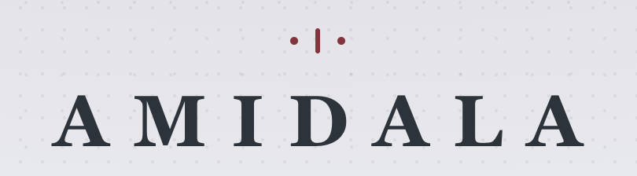
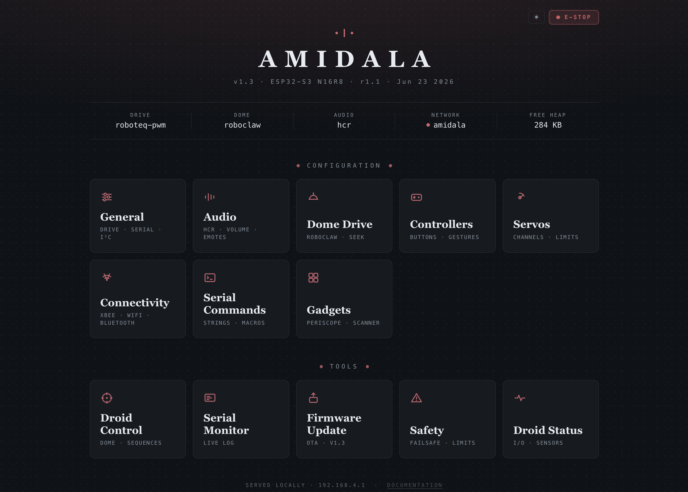
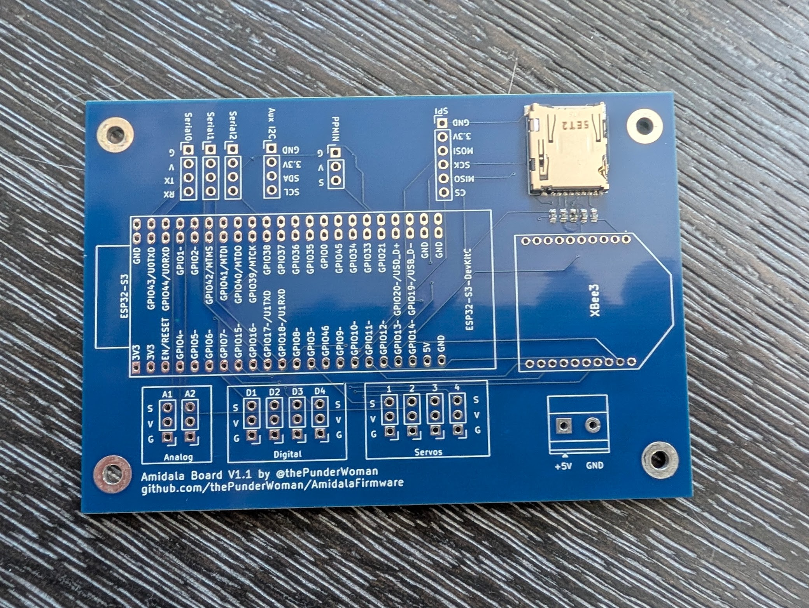
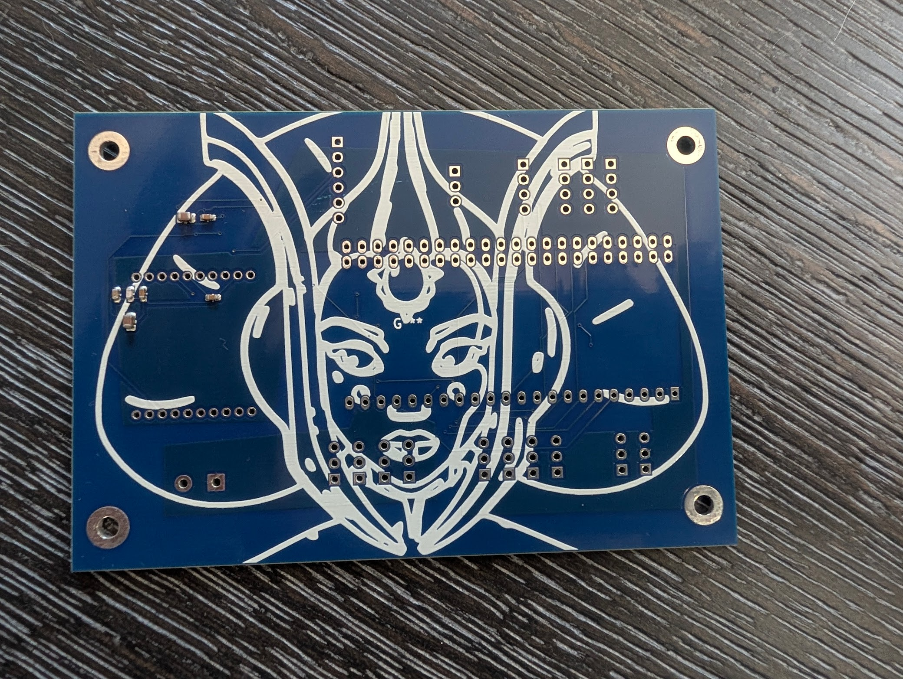

  

  
  

**Amidala** is an ESP32-S3 firmware for controlling your droids. It runs on the [Amidala PCB](PCB/) — a PCB designed to make wiring a full-featured droid build straightforward — and is compatible with both the N8R2 (8 MB flash) and N16R8 (16 MB flash) module variants. Amidala is designed to pair with [Snips Controllers](https://github.com/thePunderWoman/SnipsControllers), coming soon, but can work with older Stealth controllers, bluetooth, or RC.

> **Building from source?** Flash size and PSRAM mode are baked into the firmware image at build time, so you need to tell PlatformIO which module your board has *before* your first flash — it can't be changed later via the web UI. Check the label on your ESP32-S3 module (or your PCB order) for "N8R2" or "N16R8", then build/upload with the matching environment: `pio run -e esp32s3-n16r8 -t upload` (the default) or `pio run -e esp32s3-n8r2 -t upload`. Just want to flash a droid rather than develop firmware? The **Firmware Installer** wizard below flashes a prebuilt image over USB — no toolchain needed.

> **[Amidala Wizards →](https://thepunderwoman.github.io/Amidala/)** — browser-based tools for setting up your droid. Includes a **Firmware Installer** for flashing prebuilt firmware over Web Serial, and a **Config Converter** for migrating Stealth RC / OG Amidala configs to the current format.

---

## Features

- **XBee wireless control** — secure, long-range, low-latency control via XBee 3 modules
- **Multiple Controller Support** — works with Snips Controllers (currently in prototype stage), classic stealth controllers, standard Bluetooth gamepads, and analog RC (PPM) input.
- **Wi-Fi configuration UI** — browser-based interface for fully configuring your droid without needing to pull the SD card.
- **WCB mesh networking** — join a [WCB](https://github.com/greghulette/WCBClient) ESP-NOW mesh to coordinate commands across multiple boards (e.g. a separate body controller) with no extra wiring.
- **Native HCR support** — full Human Cyborg Relations vocalizer integration.
- **Built in Serial Monitor** — full featured onboard native serial monitor to view traffic in real time, even across your WCB Mesh.
- **Advanced Dome Drive** — Built-in support for auto dome drive with a Pololu encoder motor and hall sensor, or any other basic PWM dome drive.
- **Flexible drive systems** — PWM, Sabertooth serial, or RoboteQ (PWM, serial, or hybrid)
- **Native built-in safety features** — Web based e-stop, dome obstruction motor disconnect, auto motor disable on controller disconnect.
- **Layers of controller button configurations** — with short-press, double-press, long-press, and alt-modifier layers
- **Effectively unlimited serial strings and gestures** — the only limits are your imagination!
- **Reassignable GPIO pin roles** — trade any of the board's digital output, analog input, PPM, or servo headers for another role right from the web UI (e.g. give up a digital output for a 5th servo channel), no reflashing needed
- **Reassignable dome/drive serial ports** — move the dome drive or drive system's serial link (RoboClaw, Sabertooth, RoboteQ serial) onto either of the board's two hardware UARTs from the web UI, for wiring that doesn't match the reference PCB or to free up a header for other hardware
- **And more** — I2C aux output, digital outputs, analog inputs, SD card config, servo outputs, and emergency stop handling

---

## Controller Support

Amidala is natively designed to work with [Snips Controllers](https://github.com/thePunderWoman/SnipsControllers) or other XBee-based dual handheld pocket controllers. It can also be used with standard Bluetooth controllers and RC.

## Web Configuration UI

  

The Amidala web interface allows you total control over your droid's configuration. You can set up your controller configuration, which buttons trigger what, add serial commands, set defaults for audio, dome positioning, safety timeouts, emergency stop commands, configure Bluetooth, see digital pin statuses, use the serial monitor, configure your droid's gadgets, and even use the droid control page to trigger sequences, trigger emotes, and dome controls. See more in the wiki.

## Availability and Pricing

Amidala boards are currently available to beta testers. Please let me know if you would prefer to have it pre-soldered or bare. Either way, it will come with the headers, slots, jumper, and power terminals. The ESP32-S3-N16R8 is standard and can be sourced from your favorite location. You will also need an XBee3 module if you intend to use Snips or Stealth controllers with your build. See the Wiki page for details on the recommended options. Price is $20 per board plus shipping, which includes a small donation to charity. Note: This does __not__ include controllers. However, once Snips Controllers are past the prototype phase, we will offer them together with Amidala.

Please reach out if you are interested in helping beta test.

## Get Started

> **[Documentation Wiki →](https://github.com/thePunderWoman/Amidala/wiki)**

The wiki covers everything from first flash through full configuration. For a quick look at every available config key, see [example_config.txt](example_config.txt) — it's a complete annotated reference used on a real build. Although once you get set up initially, you won't need to look at this file again, as you can update every config option through the web UI.

---

## The Amidala PCB

  
  

The Amidala PCB is a purpose-built carrier for the ESP32-S3, designed to consolidate all the connectors a typical R2 build needs onto a single board:

- 4 servo headers (LEDC PWM)
- 4 digital output pins
- 2 analog inputs
- 3 serial headers (UART0 primary out, plus UART1 and UART2 for the dome drive and drive system's serial link — reassignable between the two, see below)
- Auxiliary I2C header
- Native XBee slot (SPI, no adapter needed)
- Micro SD card reader
- Additional SPI breakout
- PPM input for RC receivers

> The servo, digital output, analog input, and PPM header counts above are just the defaults — each of those 11 pins can be independently reassigned to a different role from the web UI's Pins page (e.g. trade a digital output for a 5th servo channel, up to the ESP32-S3's 8-channel PWM ceiling). A reboot applies the change; no reflashing or rewiring of the PCB itself is needed.
>
> Likewise, UART1 and UART2 default to the dome drive and drive system's serial link respectively (matching the reference wiring), but either can be reassigned to the other from the web UI's Serial Ports page — e.g. if your build's wiring swaps which header the RoboClaw is actually connected to. UART0 always carries the primary serial-out / WCB mesh path and isn't reassignable.

> **[PCB details, schematics, and BOM →](PCB/)**

---

## License

This project is released under the [GNU General Public License v2](LICENSE). You are free to use, modify, and distribute it — including your own modifications — as long as you share the source code of any distributed derivatives under the same license.

---

## Contributing

Bug reports and feature requests are welcome — please use the [issue tracker](https://github.com/thePunderWoman/Amidala/issues).

If you'd like to contribute code, see [CONTRIBUTING.md](CONTRIBUTING.md).
